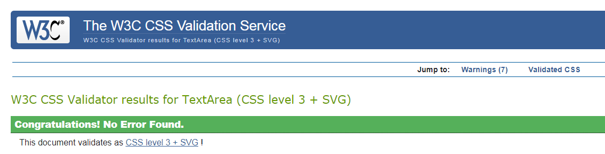
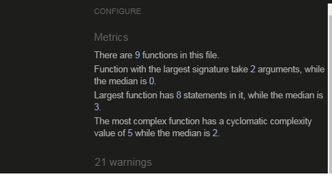

span id="top"></span>

Back to [README](README.md)

## Index

- <a href="#testing-manual">Manual Testing</a>
- <a href="#testing-auto">Automated Testing</a>
- <a href="#testing-responsive">Responsiveness</a>
- <a href="#testing-resolved">Resolved issues</a>
- <a href="#testing-unresolved">Unresolved issues</a>

---

<span id="testing-manual"></span>

## Manual testing

The following tests have been carried out without issue:

**Navigation bar**

On screen widths greater than 991px:
The correct menu options appear depending on the user's session status:
  - **Not logged in**: Home, Log In, Register 
  - **Logged in**: Home, Profile, New Video, Video Library, Log Out
  - **Logged in as "admin"**: Home, Profile, New Video, Video Library, Manage Categories, Log Out
- Tapping/clicking each link takes the user to the relevant page, or logs the user out.
- Clicking on Navbar brandlogo takes user back to index page.


Mobile:
 
- The available menu options are replaced by a hamburger icon.
- All available menu options appear in a Sidenav when the hamburgwer icon is tapped/clicked. 
- Video *Wunderkammer* brand logo in Navbar reduced to *Wunderkammer* only on medium sized devices and down to avoid text overflow on next line.


**Footer**

- The footer 'sticks' on the bottom of the screen with only baisc content.
- Each social media link opens the relevant external page in a new window.


**Home page**

- All links in the navbar direct to the correct pages.
- Three slider images with two sets of header on each introduce to the main purpose and functionality of the app.
- "Featured Videos" shows a random selection of four videos.


**Log In page**

- Entering a username or password not matching the form validation highlights the issue to the user via red color first and, upon clicking/tapping Login button, a tooltip "Please match the requested format"
- Entering either an incorrect username or password triggers a Flash message "Incorrect Username and/or Password".
- When the 'Log In' button is tapped/clicked with valid details, the user is redirected to their Profile page and a Flash message including their username indicates they have successfully logged in.
- The 'Register' link below the login fields takes the user to the Register page.


**Register page**


- Entering a username or password not matching the form validation highlights the issue to the user via red color first and, upon clicking/tapping Register button, a tooltip "Please match the requested format"
- Submitting a username (upper or lowercase) which has already been registered reloads the page and displays a Flash message "Username already exists"
- When the 'Register' button is tapped/clicked with valid details, the user is redirected to their Profile page and a Flash message indicates "Registration successful"
- On registering, the new user's username and password are added to the Users collection on MongoDB.
- The 'Log In' link below the Register fields takes the user to the Log In page.

**Video Library page**

Search functionality:

- After entering a term in the search field and either tapping/clicking the search icon or pressing Enter, the correct results are displayed as long as number of results is in excess of pagination PER_PAGE limit.
- Tapping/clicking the cancel icon reloads the page with no query applied.
- The section heading updates to reflect the search term used.
- If no results are found, a Flash message appears "No results found".

Video Containers & Collapsibles:

- All test videos in the database are displayed, each with the title, author, abstract, venue, and date as inserted by the user. 
- All videos can be watched with sound on/off, either on full, small screen, or picture in picture mode. They can also be downloaded.
- Videos are displayed with the oldest at the top (sorting the video_id not yet implemented).
- If the user is logged in and has added a video, the edit interface is displayed within the collapsible title field comprising edit, delete, and 'like' icons. The like functionality is inactive for now, but the edit and delete icons lead the user respectively to the edit video page or to a modal with further options of cancel or delete video.
- Like icon has hover effect on moused over.

Pagination:

- The number of visible videos is limited to 4 per page.


**Add Video page**

- The large 'Upload Video' button at the top of the form is wired to the Cloudinary upload widget which upon tapping/clicking the button pops up for the user to upload a video.
- The widget is customized to currently allow three different upload methods: via my files, web adress (public URL), or google drive. The first option can be performed either by drag and dropping the video file into the upload widget, or by browsing their files.
- Currently, the video needs to be uploaded before all other fields are being filled in, otherwise the form will be submitted without video.
- Upon tapping/clicking 'Done' on the widget, a unique URL for the video on Cloudinary is added to the video link field on the upload form, and the user can continue filling in the remaining fields of Title, Author/Presenter, Video Abstract, Venue, Date, and Video Category.
- The 'Choose category' input field is populated with the document from the Categories collection on MongoDB. Changes to that list, which currently stands at 14 categories, by the Admin or creator of this site are reflected in the dropdown.
- Input field validation and character limitations function as expected, indicating issues with input.
- The 'Add Video' button:
  - Adds the video to the video collection.
  - Redirects to the user to the video library page, showing the new video at the end of the video collapsibles.
  - Displays a Flash message confirming video has been successfully added.


**Edit Video page**

The same tests as for Add Video were undertaken, with the following additional tests:
- The input fields are prepopulated with the video's existing values where available.
- The 'Save Changes' button:
  - Changes the videos's values in the vieos MongoDB collection.
  - Displays a Flash message confirming activity has been successfully added.
  - Redirects user to video library page.


**Manage Categories page**

- The page is only accessible if logged in as "Admin".
- All categories from the MongoDB categories collection are shown in cards.
- The edit/delete icons allow the Admin to either proceed to the edit category form, or delete a category via a confirm delete modal.


**Add/Edit Category pages**

- The pages are only accessible if logged in as Admin.
- Categories can be added via the 'Add Category' button on the Manage Categories page which leads the Admin to a single field to insert a new category name. 
- The delete icon on the Manage Categories page is wired up to a confirm delete modal which also offers the option to cancel.
- The edit icon leads the Admin to the 'Edit Category' template almost identical to the 'Add Category' on which the category name can be updated.


**Profile page**

- Unfinished as yet.
- Username interjected dynamically into profile card.
- Icons to edit and delete icon in place, but only the latter is functional bringing up a confirmation modal with option to cancel.
- Username's favourite and uploaded videos show with content to be added at a later stage from MongoDB and Cloudinary.


<div align="right"><a style="text-align:right" href="#top">Go to index</a></div>


<span id="testing-auto"></span>

## Automated testing

[Chrome DevTools](https://developers.google.com/web/tools/chrome-devtools) - Lighthouse was used to test the performance of the application on all pages on mobile and desktop.

The following reports were generated:

*videos.html - Home:*

* Performance: REDO as currently at 19%

* Accessibility: 74%

"iframe elements do not have a title"
"Image elements do not have [alt] attributes"

- I added a title to the iframe tags and all attributes to all img

"Links do not have a discernible name"

- This refers to social link icons and not quite sure what to make of it 

* Best Practices: 80

"Browser errors were logged to the console"
"Issues were logged in the Issues panel in Chrome Devtools"

- CHECK

* SEO: 83

"Document does not have a meta description" 

- I added _meta name="Description" content=""_ providing a summary of the page content. 

"Image elements do not have [alt] attributes"

- I added them

*Profile.html*

* Performance:73

"Does not use passive listeners to improve scrolling performance"

Adding 'touchstart', onTouchStart, {passive: true} to my event listener functions, as advised, threw up errors so I left it as it is.

"Image elements do not have explicit width and height"

As I use the MaterializeCSS class="circle responsive-img", I skipped that.


* Accessibility:95
* Best Practices:87 because of console errors
* SEO: 100

*Add_Video.html*

* Performance. 92
* Accessibility:80

"Form elements do not have associated labels"
That refers to the categories drop-down for which I do not see the option to add another "label for" tag so I left it.

"Links do not have a discernible name"

Again, in the footer

* Best Practices:93 because of console errors
* SEO: 89

"Document doesn't use legible font sizes"
- Let's check again after white etxt converted to black text, but this might concern font size only

"Tap targets are not sized appropriately"
added margin of 8px around category validate class

*edit_video.html*

* Performance: 94

remove unused CSS and JS 
* Accessibility: 84
"Links do not have a discernible name"
"Form elements do not have associated labels"
That refers to the categories drop-down for which a label for tag is already in place and adding another one does not make sense, especially as the category field is populated with 
data from mongoDB.
* Best Practices: 93
 issues with JS

* SEO: 98

I have a full stop under my category drop down which is not meant to be there
"
Tap targets are not sized appropriately"
Category drop down is overlaping with label text on open: need to put margin/padding

*Library.html*

The page loaded too slowly to finish within the time limit. Results may be incomplete.

* Performance: 81

"Does not use passive listeners to improve scrolling performance"
- see above

* Accessibility:85

"Buttons do not have an accessible name"

Added aria-label = "Center Align"

"Links do not have a discernible name"

As above, this concerns social links, but here also search and reset buttons. I added tooltips to them for better accessibility, but I do not know whether Lihgthouse rewards that.

* Best Practices:87 because of console errors

* SEO: 88

"Links are not crawlable"
This refers to two < a > tags from the {{pagination.links}} flask extension which I do not seem to be able to change

"Tap targets are not sized appropriately"

Refers to pagination links for which I now added margin and padding

*logout.html, Login.html, register.html*

* Performance: 94
* Accesibility: 96

"Links do not have a discernible name"

* Best Practices: 87 remove browser errors
* SEO: 100

*add_category.html*

* Performance: 93
* Accessibility: 93
"Links do not have a discernible name"

* Best Practices: 87
* SEO: 100

*edit_category.html*

* Performance: 93
* Accessibility: 81
"Links do not have a discernible name"
"Form elements do not have associated labels"
That refers to the categories drop-down for which a label for tag is already in place and adding another one does not make sense, especially as the category field is populated with 
data from mongoDB.

* Best Practices: 87
* SEO: 100

    Lighthouse report is now as [follows]() 


A few opportunities to improve Performance and Best Practices on all pages remain 
and will be addressed at a later stage:

* Performance of ...:  

"Eliminate render-blocking resources"

"Serve images in next-gen formats"

"Image elements do not have explicit width and height"

* Best Practices in both pages:

"Browser errors were logged to the console" which concerns an issue with _link rel="manifest" href="/site.webmanifest"_ which I was unable to resolve.


[W3C - CSS](https://jigsaw.w3.org/css-validator/) returned:




In response to the [W3C - HTML](https://validator.w3.org/) errors shown:

- that the frameborder attribute on the iframe is obsolete, I removed it entirely,
- that I had a number of stray end tags, closed a number of < divs > properly.

I was unable to solve the "duplicate ID" error, however, referring to the modal structures across the templates, as I needed both btn-flat classes but styled differently. As these are Materialize Css classes, I could not remove them without messing up the button structure, so the only solution I saw was to use an id selector on one of them.

Validation by URL input now returns:


[CSS Lint](http://csslint.net/) - 0 errors, 19 warnings - **PASS**

- most warnings refer to "Don't use adjoining classes".
- Others read "Don't use IDs in selectors". Selecting via IDs, however, 
has only been used for styles which will not be reused and the specificity was needed.
- A few had to do with "Disallow qualified headings" for which I do not see any other solution than those in place.
- In one instance it was about "Disallow overqualified elements". This was a list element for which the qualification is necessary to both override Materialize and 
link up on the output of Flask Paginate.


[JS Hint](https://jshint.com/) returned:

 


<div align="right"><a style="text-align:right" href="#top">Go to index</a></div>

<span id="testing-responsive"></span>

## Responsiveness


The site is supported by [Materialize](https://materializecss.com/) and has been thoroughly tested at all stages of development using [Chrome DevTools](https://developers.google.com/web/tools/chrome-devtools).
MaterializeCSS may limit design choices and customization at times, but this was an acceptable compromise given the advantages provided, such as a fluid responsive grid system which was used throughout this site, including the container class and a number of [Helpers](https://materializecss.com/helpers.html), such as classes for text-align and hiding/showing content.


Examples:

For the brand logo in the Navbar, for instance, I had to make sure to prevent the 'Video *Wunderkammer*' to breaking on to next line on small screen sizes. After studying the options provided by CSS, such as white-space/nowrap,
I applied the MaterializeCSS class "hide-on-med-and-down" for 'Video' text part, and even although the *Wunderkammer* is still not place entirely in the middle vis-à-vis the hamburger menu on small screens, it is by far the best solution I was able to find.
Similarly, I added 'hide-on-small-only' to all h4s in the code for the slider in videos.html to avoid over-cluttering with text on small screen.
Additionally, MaterializeCSS provides a number of responsive classes, such as 'responsive-img' and 'responsive-video' which were both used on videos.html, library.html, and profile.html.


<div align="right"><a style="text-align:right" href="#top">Go to index :arrow_double_up:</a></div>

### Browsers

Tested on:

- Chrome
- Edge
- Firefox
- Safari (iOS)


### Screen sizes

Tested with Chrome DevTools using profiles for:


- Galaxy S5
- Pixel 2
- iPhone 5 SE
- iPhone 6/7/8
- iPhone X
- iPad Pro

I also used the responsive profiles of:

- Mobile M (375px)
- Mobile L (425px)
- Tablet (768px)
- Laptop (1024px)
- Laptop L (1440px)

Real world testing on:

- iPad 
- iPhone 11 Pro
- MSI NOtebook MS-16GG
- Huawei 


<div align="right"><a style="text-align:right" href="#top">Go to index</a></div>


## Issues and bugs

<span id="testing-resolved"></span>

### Resolved

**Materialize select dropdown does not function properly, especially form validation**

A known bug with Materialize by which a custom CSS style of display: none is applied on all < select > elements meaning they either appear as normal < input > field, or with the wrong styling. 
Solution: Copy and paste custom JS code for form validation from Tim Nelson for CI's Task Manager Mini Project lesson "Materialize Form Validation"

**As MongoDB is not really suitable to store video files, I needed to find a way to store videos somewhere else while inputting the video URL to a form to  be submitted to MongoDB together with the other video metadata such as author, date, and venue.**


Solution: The upload widget should take a callback function as an argument. Once the video file is uploaded, the function is called with an object as one of its parameters that includes the file's uploaded URL. This is injected into the HTML form for uploading a video via getElementbyId. See my JS code, line 63-66, in combination with line 81 in add_video.html.


**Paginate linting error**

Alerted to in Gitpod:
```console
Possible unbalanced tuple unpacking with sequence defined at line 233 of flask_paginate: left side has 3 label(s), right side has 2 value(s)pylint(unbalanced-tuple-unpacking)
```

- Solution: running `app.py` through Flake8 does not show this to be an error.


<div align="right"><a style="text-align:right" href="#top">Go to index</a></div>

<span id="testing-unresolved"></span>


### Unresolved

**Pagination link not finding type of $search videos searched**

This error occurs when a search was applied showing a number of results below the `PER_PAGE` pagination limit. 
Ed Young has a solution in his TESTING.md but it did not work for my code.

**Editing a video from the videos.html site, when option of cancel is chosen, leads user not back to video.html, but library.html**

I would need to write another url_for
